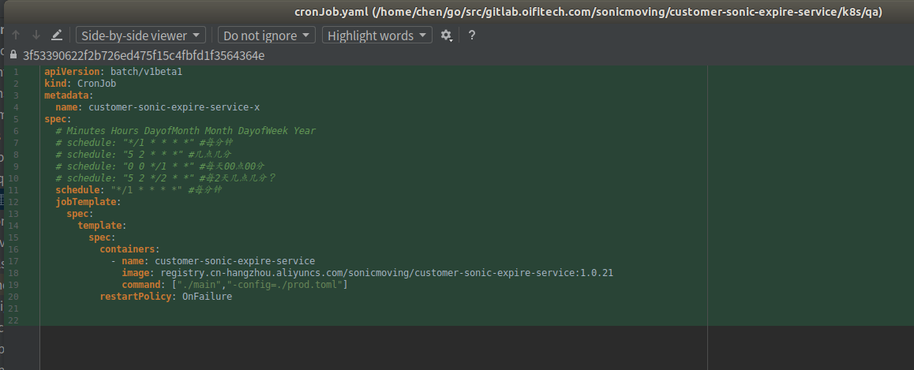

# go项目部署到Kubernetes集群CronJob项目参数配置(笔记)
    k8s-cronJob-deploy-go-project

### 方法一(k8s部署文件env环境变量)
    项目结构
    
        
    a.Dockerfile文件编写
        # build
        FROM registry.cn-hangzhou.aliyuncs.com/sonicmoving/golang:1.9 AS build
        WORKDIR /opt/customer-sonic-expire-service
        
        ADD main /opt/customer-sonic-expire-service
        
        CMD  ["./main"]
        

        
   
   
     b.镜像打包上传
       先打包main,再进行镜像打包
       
       chen@chen: cd ~/go/src/gitlab.oifitech.com/sonicmoving/customer-sonic-expire-service
       sudo root
       GOOS=linux go build -o main main.go
       docker build -t customer-sonic-expire-service:1.0.23 .
       sudo docker tag [ImageId] registry.cn-hangzhou.aliyuncs.com/sonicmoving/customer-sonic-expire-service:[镜像版本号]
           docker images -> 查询[ImageId] 15f7d3c8a063
           sudo docker tag 34ccee7e7d19 registry.cn-hangzhou.aliyuncs.com/sonicmoving/customer-sonic-expire-service:1.0.23
       sudo docker push registry.cn-hangzhou.aliyuncs.com/sonicmoving/customer-sonic-expire-service:1.0.23
        
    c. K8S定时任务部署文件
        apiVersion: batch/v1beta1
        kind: CronJob
        metadata:
          name: customer-sonic-expire-service-x
        spec:
          # Minutes Hours DayofMonth Month DayofWeek Year
          # schedule: "*/1 * * * *" #每分钟
          # schedule: "5 2 * * *" #几点几分
          # schedule: "0 0 */1 * *" #每天00点00分
          # schedule: "5 2 */2 * *" #每2天几点几分？
          schedule: "*/1 * * * *" #每分钟
          jobTemplate:
            spec:
              template:
                spec:
                  containers:
                    - name: customer-sonic-expire-service
                      image: registry.cn-hangzhou.aliyuncs.com/sonicmoving/customer-sonic-expire-service:1.0.23
        #              command: ["./main","-config=./prod.toml"]
                      env:
                      - name: MongoDbHost
                        value: "dds-xxx-pub.mongodb.rds.aliyuncs.com:3717"
                      - name: MongoDbName
                        value: "sm-cust-qa"
                      - name: MongoDbUser
                        value: "sm_cust_qa"
                      - name: MongoDbPassword
                        value: "yyy"
                      - name: MailHost
                        value: "smtp.exmail.qq.com"
                      - name: MailPort
                        value: "465"
                      - name: MailFrom
                        value: "noreply@zzz.cn"
                      - name: MailPassword
                        value: "www"
                  restartPolicy: OnFailure
        

   
   
### 方法二(动态选择toml文件)
    项目结构
    
        
    a.Dockerfile文件编写
        # build
        FROM registry.cn-hangzhou.aliyuncs.com/sonicmoving/golang:1.9 AS build
        WORKDIR /opt/customer-sonic-expire-service
        
        ADD main /opt/customer-sonic-expire-service
        ADD /toml/old.toml /opt/customer-sonic-expire-service
        ADD /toml/qa.toml /opt/customer-sonic-expire-service
        ADD /toml/prod.toml /opt/customer-sonic-expire-service
        
        CMD  ["./main","-config=./qa.toml"]
        
   
   
     b.镜像打包上传
       先打包main,再进行镜像打包
       
       chen@chen: cd ~/go/src/gitlab.oifitech.com/sonicmoving/customer-sonic-expire-service
       sudo root
       GOOS=linux go build -o main main.go
       docker build -t customer-sonic-expire-service:1.0.23 .
       sudo docker tag [ImageId] registry.cn-hangzhou.aliyuncs.com/sonicmoving/customer-sonic-expire-service:[镜像版本号]
           docker images -> 查询[ImageId] 15f7d3c8a063
           sudo docker tag 34ccee7e7d19 registry.cn-hangzhou.aliyuncs.com/sonicmoving/customer-sonic-expire-service:1.0.23
       sudo docker push registry.cn-hangzhou.aliyuncs.com/sonicmoving/customer-sonic-expire-service:1.0.23
        
    c. K8S定时任务部署文件
        apiVersion: batch/v1beta1
        kind: CronJob
        metadata:
          name: customer-sonic-expire-service-x
        spec:
          # Minutes Hours DayofMonth Month DayofWeek Year
          # schedule: "*/1 * * * *" #每分钟
          # schedule: "5 2 * * *" #几点几分
          # schedule: "0 0 */1 * *" #每天00点00分
          # schedule: "5 2 */2 * *" #每2天几点几分？
          schedule: "*/1 * * * *" #每分钟
          jobTemplate:
            spec:
              template:
                spec:
                  containers:
                    - name: customer-sonic-expire-service
                      image: registry.cn-hangzhou.aliyuncs.com/sonicmoving/customer-sonic-expire-service:1.0.21
                      command: ["./main","-config=./prod.toml"] #根据qa、prod环境切换配置文件
                  restartPolicy: OnFailure
   
                    
    
